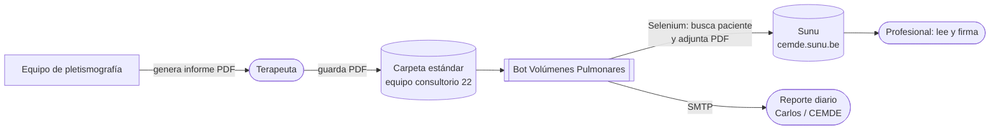
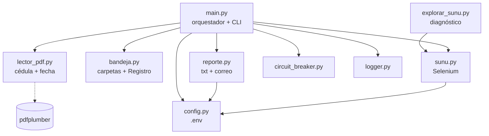
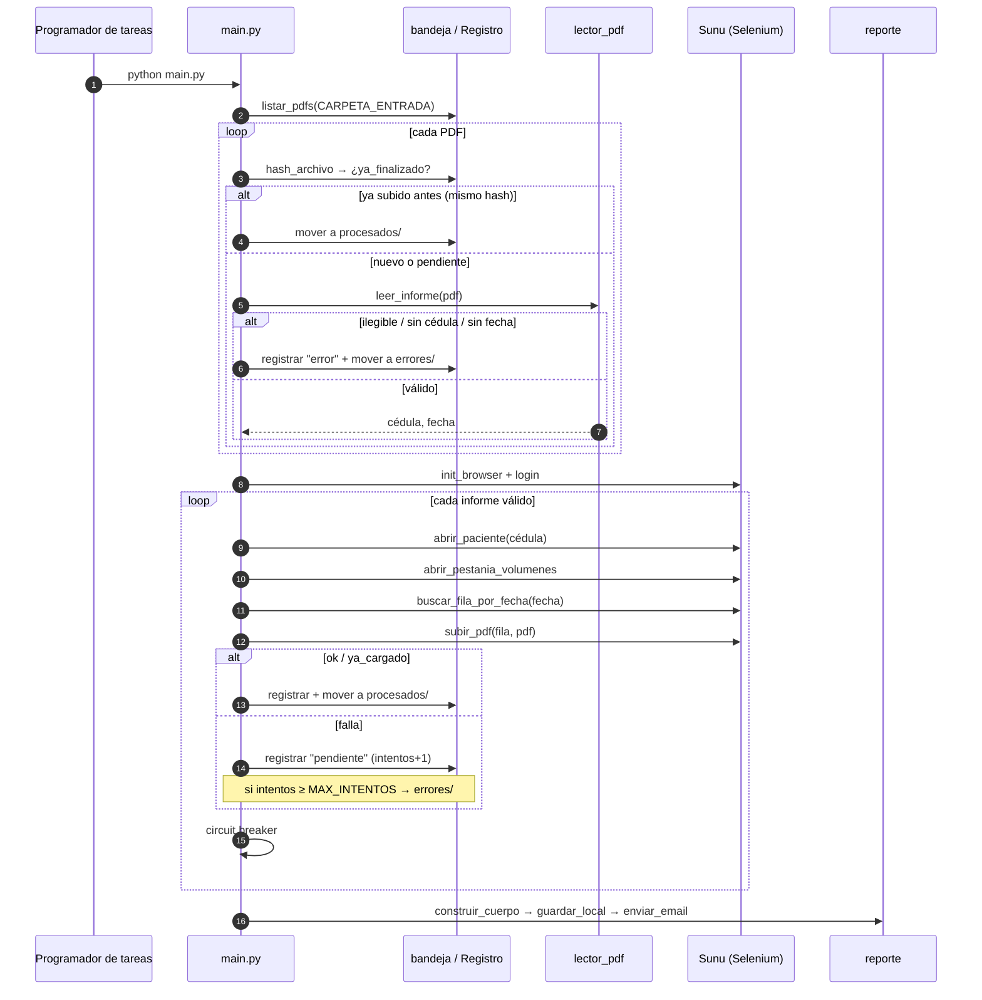
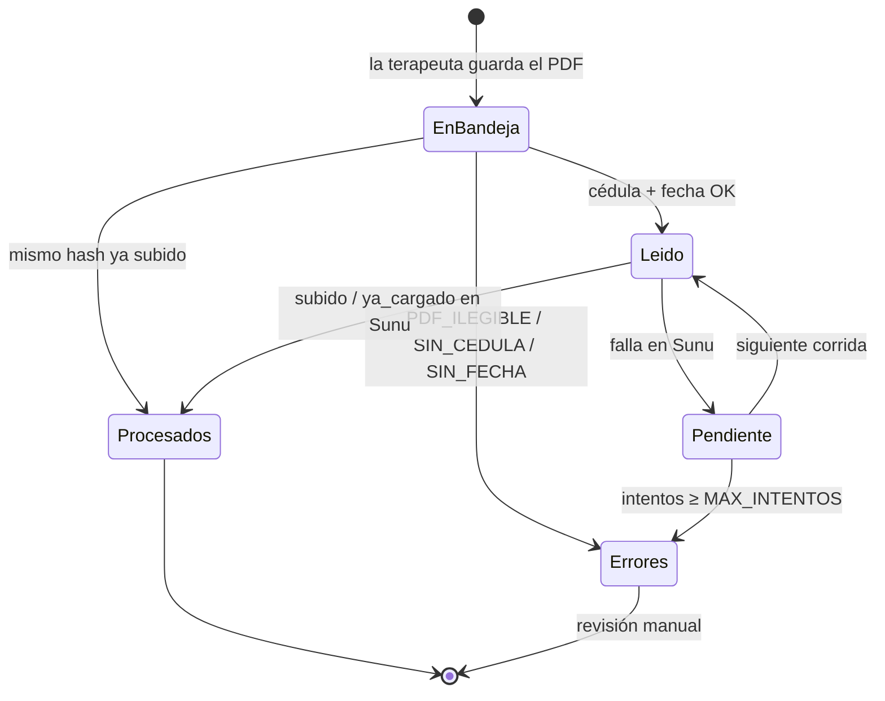

# Arquitectura — Bot Volúmenes Pulmonares

| | |
|---|---|
| **Proyecto** | Ampliación del Bot RPA de Espirometrías, CEMDE (Fase 2, cotización CEMDE-2026-01) |
| **Alcance** | Carga automática de informes de volúmenes pulmonares por pletismografía, sede Laureles, consultorio 22 |
| **Estado** | Estructura inicial. Selectores de Sunu y lector de PDF pendientes de validar en campo (ver §11) |
| **Autor** | Sebastián Molina Henao |

---

## 1. Contexto

Hoy la terapeuta envía por correo cada informe PDF de volúmenes pulmonares y alguien lo adjunta a mano en la historia clínica de Sunu. En el kickoff (23/09/2026) se acordó cambiar el correo por una **carpeta estándar** en el equipo del consultorio: la terapeuta guarda ahí el PDF y el bot lo sube.



**Fuera de alcance:** la lectura y firma médica en Sunu (el bot solo adjunta), crear registros de volúmenes en Sunu, y otras sedes o tipos de examen.

## 2. Componentes



| Módulo | Responsabilidad | Depende de |
|---|---|---|
| `main.py` | Orquesta las fases (lectura → carga → reporte), CLI (`--solo-leer`, `--sin-correo`), límite de tiempo, reinicio del navegador, limpieza de `debug/` | todos |
| `config.py` | Única fuente de configuración (`.env`). Crea las carpetas de trabajo al importarse | `python-dotenv` |
| `modules/lector_pdf.py` | Extrae la **cédula** y la **fecha del examen** del PDF. Funciones puras sobre texto más `extraer_texto` (pdfplumber, import diferido) | `pdfplumber` |
| `modules/bandeja.py` | Lista los PDF de la carpeta de entrada, los mueve a `procesados/` y `errores/` sin sobrescribir, y mantiene el `Registro` persistente por hash | stdlib |
| `modules/sunu.py` | Login, búsqueda global de pacientes, pestaña de volúmenes, fila por fecha, modal de adjuntos y capturas de diagnóstico | `selenium`, `config` |
| `modules/reporte.py` | Arma el cuerpo del reporte, lo guarda en `data/` y lo envía por SMTP con reintentos (si falla, deja copia local) | `config` |
| `modules/circuit_breaker.py` | Corta el lote ante N fallos consecutivos con la misma causa | — |
| `explorar_sunu.py` | Herramienta de solo lectura: vuelca pestañas y HTML del perfil para confirmar selectores | `sunu` |

`sunu.py`, `circuit_breaker.py`, `logger.py` y la lógica de correo vienen de `bot_espirometrias`, que ya está probado en producción (ver §9).

## 3. Flujo de ejecución



## 4. Ciclo de vida de un informe



Un informe **pendiente** se queda en la raíz de la carpeta de entrada, así que se reintenta solo en la siguiente corrida sin intervención de nadie.

## 5. Datos y persistencia

```
CARPETA_ENTRADA/                 (ej. C:\Volumenes, en el equipo del consultorio)
├── *.pdf                        pendientes de procesar
├── procesados/AAAA-MM-DD/       subidos o ya cargados
└── errores/AAAA-MM-DD/          para revisión manual

<proyecto>/
├── data/registro.json           estado por hash (ver abajo)
├── data/reporte_*.txt           copia local de cada reporte
├── data/EMAIL_NO_ENVIADO_*.txt  reportes cuyo correo falló
├── logs/bot_*.txt               log detallado por corrida
└── debug/*.png|*.html           capturas de fallos (se purgan a los DEBUG_RETENTION_DAYS)
```

**`data/registro.json`**: un diccionario indexado por el SHA-256 del PDF.

```json
{
  "9f2c…": {
    "intentos": 1,
    "archivo": "Nombre apellido_LVM_22092026_110217.pdf",
    "estado": "pendiente",
    "cedula": "12345678",
    "fecha": "2026-09-22",
    "motivo": "FILA_NO_ENCONTRADA",
    "actualizado": "2026-09-23T19:00:05"
  }
}
```

- **Estados:** `subido` y `ya_cargado` son finales. `pendiente` suma un intento. `error` queda para revisión.
- **Escritura:** atómica (archivo `.tmp` y luego `replace`). Si el registro se corrompe, se respalda como `registro.corrupto_*.json` y se empieza de cero. En el peor caso se reintenta un informe y Sunu lo reporta como `ya_cargado`.

## 6. Manejo de errores y resiliencia

| Situación | Dónde | Efecto | ¿Cuenta intento? |
|---|---|---|---|
| `PDF_ILEGIBLE`, `SIN_CEDULA`, `SIN_FECHA` | lectura | Pasa directo a `errores/` | — |
| `PACIENTE_NO_ENCONTRADO` | Sunu | Pendiente | Sí |
| `FILA_NO_ENCONTRADA` (la fila de la fecha aún no existe) | Sunu | Pendiente | Sí |
| `MODAL_NO_ABRIO`, `BOTON_*`, `SIN_CONFIRMACION` | Sunu | Pendiente + captura en `debug/` | Sí |
| `TIMEOUT`, `ERROR_INESPERADO` | Sunu | Pendiente + captura | Sí |
| Falla el login o el navegador no arranca | Sunu | Se aborta la carga y el correo sale con **[ALERTA]** | **No** |
| El navegador deja de responder a mitad del lote | Sunu | Hasta 2 reinicios; después se aborta con alerta | No (los restantes no se tocan) |
| 5 fallos consecutivos con la misma causa | circuit breaker | Se aborta el lote con **[ALERTA]** | Solo los ya procesados |
| Se pasa de 1 hora de ejecución | `main.py` | Se detiene; el resto queda para la próxima corrida | No |
| Falla el SMTP | reporte | 3 reintentos; si no sale, copia en `data/EMAIL_NO_ENVIADO_*` | — |

Lo que guía estas reglas: **un problema del sistema (Sunu caído, UI cambiada, red) nunca debe mandar informes buenos a `errores/`**. Por eso el login no cuenta como intento y el circuit breaker corta antes de agotar el lote.

## 7. Decisiones de diseño

| # | Decisión | Motivo | Alternativa descartada |
|---|---|---|---|
| D1 | **Carpeta estándar** como entrada | Acordado en el kickoff. La terapeuta no usa ningún software nuevo y el bot no depende de leer un buzón de correo | Leer el correo de la terapeuta (credenciales de correo y formato de mensajes variable) |
| D2 | **Cédula tomada del contenido del PDF** | El nombre del archivo que genera el equipo trae nombre y fecha, pero no la cédula. Buscar en Sunu por nombre no es confiable | Pedir a la terapeuta que renombre cada archivo (error humano) |
| D3 | **Dos capas contra duplicados**: hash del archivo en el registro local y detección de "ya cargado" en el modal de Sunu | El hash evita trabajo si se copia el mismo archivo otra vez. Sunu cubre el caso de reexportar el mismo examen (bytes distintos) o de una carga manual previa | Solo una de las dos |
| D4 | **Repositorio separado** de `bot_espirometrias`, copiando el código de Sunu | Flujo distinto (sin MirSpiro ni Excel) y despliegue independiente. Cambiar este bot no pone en riesgo el que ya está en producción | Librería compartida. Se puede revisar si aparece un tercer bot |
| D5 | **Botón de adjuntos buscado dentro de la fila** encontrada | Con varios exámenes o pestañas hay varios botones en el DOM. Buscar en todo el documento puede adjuntar el PDF al examen equivocado | `driver.find_element` global (como en `bot_espirometrias`) |
| D6 | **Selectores de la pestaña de volúmenes configurables en `.env`** | Sunu ya rediseñó `/pacientes` el 2026-08-31. Ajustar un selector no debe exigir un despliegue de código | Selectores fijos en el código |
| D7 | **El fallo de sesión no cuenta intento** | Evita que una caída de Sunu mande todos los informes a `errores/` después de `MAX_INTENTOS` corridas | Contar intento en cualquier falla |
| D8 | **`pdfplumber` con import diferido** | Los tests de parseo corren sin la dependencia, y un problema al instalarla no rompe la lectura de configuración | Import a nivel de módulo |

## 8. Despliegue y operación

- **Dónde corre:** el equipo del consultorio 22 (Windows), el mismo donde la terapeuta guarda los PDF.
- **Cómo se programa:** Programador de tareas de Windows, `python main.py` una vez al día después del horario de atención, con la sesión de Windows **desbloqueada** (Chrome corre visible).
- **Convivencia con `bot_espirometrias`:** en la Fase 1 ese bot también se instala en este equipo. Usa automatización de escritorio sobre MirSpiro (foco de ventana y teclado), así que **los dos bots no deben correr al mismo tiempo**. Hay que programarlos en horarios separados, por ejemplo espirometrías primero y volúmenes 1 hora después.
- **Instalación:** `venv`, `pip install -r requirements.txt`, `.env` a partir de `.env.example`, con `CARPETA_ENTRADA` apuntando a la carpeta acordada.
- **Puesta en marcha:**
  1. `python explorar_sunu.py <cédula>` para confirmar los selectores.
  2. `python main.py --solo-leer` con PDF reales para validar el lector.
  3. `python main.py --sin-correo` con 1 o 2 informes.
  4. Programar la tarea.
- **Monitoreo:** el correo diario. Si llega un asunto con `[ALERTA]` o hay informes en `errores/`, requiere revisión el mismo día.

## 9. Relación con `bot_espirometrias`

| Pieza | Origen | Cambios |
|---|---|---|
| Login y `init_browser` | `modules/nube.py` | Sin preferencias de descarga (acá no se descargan Excel) |
| `abrir_paciente` (búsqueda global) | `modules/subir_sunu.py` | Ninguno |
| Modal de adjuntos (`_ya_cargado`, confirmación, cierre) | `modules/subir_sunu.py` | Simplificado; el botón se busca dentro de la fila (D5) |
| `CircuitBreaker`, logger | `modules/` | Nombre del logger `bot_volumenes` |
| Reporte por correo | `main.py` | Asunto etiquetado por consultorio y secciones de volúmenes |

Si Sunu cambia la búsqueda global o el modal de adjuntos, el ajuste probablemente haya que hacerlo **en ambos repositorios**.

## 10. Seguridad y privacidad

- **Tipo de datos:** son datos de salud, es decir, **datos sensibles** según la Ley 1581 de 2012. Los tratan el PDF, el nombre del archivo (trae el nombre del paciente), `data/registro.json`, los logs y las capturas de `debug/`.
- **Qué nunca se versiona:** `bandeja/`, `data/`, `logs/`, `debug/`, `*.pdf` y `.env` están en `.gitignore`. Los tests usan datos ficticios.
- **Retención:** las capturas de `debug/` se purgan automáticamente (`DEBUG_RETENTION_DAYS`, 14 días por defecto). `procesados/` y `logs/` crecen sin límite. Hay que acordar con CEMDE cuánto tiempo guardarlos (ver §11).
- **Credenciales:** van solo en `.env`, en el equipo del consultorio. El correo usa contraseña de aplicación, no la contraseña real de la cuenta.

## 11. Riesgos y pendientes

| Riesgo o pendiente | Mitigación / acción |
|---|---|
| Los selectores de la pestaña de volúmenes son una suposición (`#tab-volumenes-pulmonares`) | Confirmar con `explorar_sunu.py` en la semana 1 y ajustar el `.env` |
| La fila de volúmenes podría no crearse sola al atender al paciente | Confirmar con CEMDE. Si hay que crearla, es un cambio de alcance |
| Los patrones del lector salen de un solo informe visto en video | Validar con 3 a 5 PDF reales y agregarlos (anonimizados) como tests |
| Un adjunto **rechazado** en Sunu podría detectarse como "ya cargado" y no volver a subirse | Revisar cómo muestra el modal un rechazo y distinguirlo en `_ya_cargado` |
| PDF escaneado sin capa de texto | Termina en `errores/` como `PDF_ILEGIBLE`. Si pasa seguido, evaluar OCR |
| La terapeuta guarda el PDF en otra carpeta | La guía de uso y el reporte diario lo hacen visible (menos informes de los esperados) |
| Retención de `procesados/` y `logs/` sin política | Acordar un plazo con CEMDE y agregar la purga |
